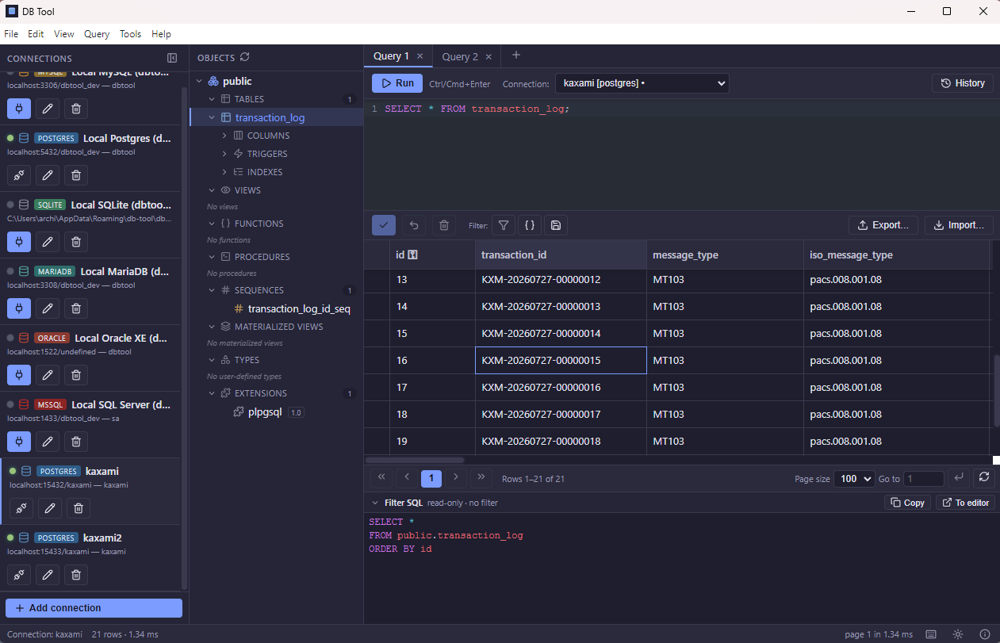
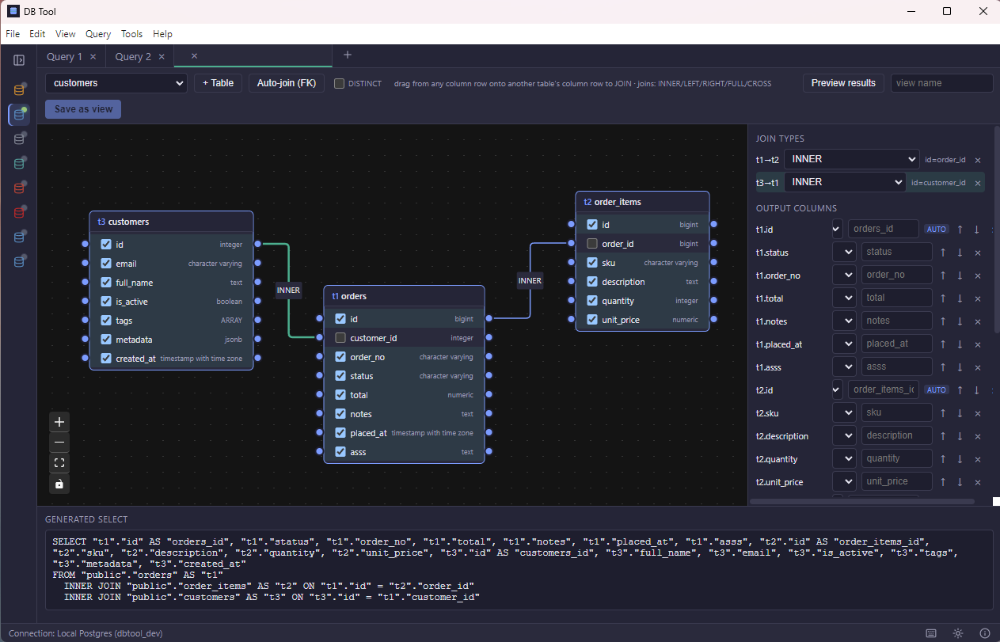

<div align="center">

# DBTool

**A full-featured desktop database client — free, open source, and cross-platform.**

Connect, browse, query and edit **PostgreSQL · MySQL · MariaDB · SQLite · Oracle · SQL Server** through one UI.

[](LICENSE)
[](COMMERCIAL-LICENSE.md)
[](#-download)
[](#-download)
[](#%EF%B8%8F-tech-stack)



</div>

---

## Table of contents

- [Why DBTool](#why-dbtool)
- [Features](#-features)
- [Screenshots](#-screenshots)
- [Download](#-download)
- [Changelog](CHANGELOG.md)
- [Quick start](#-quick-start)
- [Supported databases](#%EF%B8%8F-supported-databases)
- [Building from source](#-building-from-source)
- [Architecture](#%EF%B8%8F-architecture)
- [Tech stack](#%EF%B8%8F-tech-stack)
- [Roadmap](#-roadmap)
- [Contributing](#-contributing)
- [Security](#-security)
- [License](#-license)

---

## Why DBTool

Most full-featured database GUIs are commercial and per-seat licensed. DBTool aims to
cover the day-to-day work of a developer or DBA — browsing objects, writing SQL, editing
rows, designing tables, moving data between engines — in a single desktop app that runs
locally, stores nothing in the cloud, and is fully open source under the AGPL.

Everything runs on your machine: **no telemetry, no account, no cloud sync.** Connection
passwords are encrypted at rest with your operating system's keychain.

If you have used a commercial client such as Navicat, DataGrip or DBeaver, DBTool should
feel familiar — the object tree, the query tabs, the editable grid and the filter builder
all follow the conventions you already know.

---

## ✨ Features

**Connect & explore**
- One UI for PostgreSQL, MySQL, MariaDB, SQLite, Oracle and SQL Server
- Object tree: databases → schemas → tables / views / functions / procedures / indexes / triggers / sequences / materialized views / types / extensions
- Saved connections with **OS-keychain-encrypted passwords** (DPAPI · Keychain · libsecret/kwallet)

**Write SQL**
- CodeMirror 6 editor with **schema-aware autocomplete** — tables after `FROM`/`JOIN`, columns after `alias.`, with types shown inline
- **Multiple query tabs**, each with its own connection, restored after restart
- **Query history** per connection (searchable, click to reload, double-click to run) — SQL and metadata only, never result data

**Browse & filter data**
- **True server-side pagination** — built for millions of rows; ordering, counting and paging happen in the database
- Click-to-sort on any column (server-side), page-size selector, jump-to-page
- **Type-aware per-column filters** and a **nested AND/OR visual filter builder**, plus a raw `WHERE` mode
- **Saved filters** per table, named and reusable across restarts
- Every filter is **parameterized** — verified injection-safe, with LIKE wildcards escaped

**Edit data**
- Full in-grid **CRUD** — insert / update / delete, keyed by primary key
- Staged changes applied in **one transaction**; any error rolls the whole batch back
- Auto-increment and DEFAULT columns handled correctly; DB-assigned ids appear immediately

**Design & manage schema**
- **Visual table designer** with a live DDL preview — columns, primary keys, foreign keys, indexes
- Full per-engine type system (length, precision/scale, ENUM/SET, `WITH TIME ZONE`, UNSIGNED, arrays)
- **Destructive changes require you to retype the object name** before they run
- Views, functions and procedures: create, edit, drop — with per-engine handling (`CREATE OR REPLACE`, `CREATE OR ALTER`, or DROP + CREATE in a transaction)
- PostgreSQL extras: materialized views, user-defined types & enums, extensions, advanced index types
- **Visual view builder** — drag-and-drop join designer with a live generated `SELECT`
- **ER diagrams** with foreign-key editing

**Move data**
- **Import / export**: CSV, JSON, Excel, SQL
- Cross-engine data transfer

**Comfort**
- Dark and light themes, persisted
- Full keyboard shortcut set (press **F1** for the reference)
- Native application menu bar

---

## 📸 Screenshots

<table>
<tr>
<td width="50%" valign="top">


**Main window** — connection sidebar with six engines, object tree, multi-tab SQL editor,
editable results grid with server-side pagination and the generated filter SQL.

</td>
<td width="50%" valign="top">



**Visual view builder** — drag between column handles to create joins, tick output columns,
pick join types, and watch the `SELECT` build itself. Preview the results or save it as a view.

</td>
</tr>
</table>

---

## ⬇️ Download

Pre-built binaries — **no Node.js or other prerequisites required**, the Electron runtime is bundled.

| Platform | Download | Notes |
|---|---|---|
| **Windows** (x64) | [Installer / portable →](https://github.com/achi777/db-tool/releases/latest) | NSIS installer (per-user, no admin) or a single portable `.exe`. Builds are **unsigned** — SmartScreen may warn on first run: *More info → Run anyway* |
| **macOS** (Apple Silicon & Intel) | [`.dmg` →](https://github.com/achi777/db-tool/releases/latest) | **Signed and notarized** — opens without a Gatekeeper warning |
| **Linux** (x86_64) | [AppImage →](https://github.com/achi777/db-tool/releases/latest) | `chmod +x DBTool-*.AppImage && ./DBTool-*.AppImage` |

Release history and what changed in each version: **[CHANGELOG.md](CHANGELOG.md)**.

---

## 🚀 Quick start

1. Launch DBTool.
2. Click **Add connection**, pick your engine, and fill in host / port / user / database
   (or, for SQLite, point at a `.db` file — no server needed).
3. Hit **Test connection**, then **Save** and **Connect**.
4. Expand the tree and click a table — rows load in a paginated, editable grid.
5. Type SQL in the editor and press **Ctrl+Enter** (**⌘+Enter** on macOS) to run it.
6. Double-click a non-primary-key cell to edit it, then **Apply changes**.

Press **F1** at any time for the full keyboard-shortcut reference.

---

## 🗄️ Supported databases

| Engine | Minimum version | Verified against | Notes |
|---|---|---|---|
| **PostgreSQL** | 13 | 13 · 14 · 15 · 16 | Plus materialized views, enums & composite types, extensions, `btree`/`hash`/`gin`/`gist`/`brin` and partial/expression indexes |
| **MySQL** | 5.7 | 5.7 · 8.0 | No `FULL OUTER JOIN`; routines have no `OR REPLACE` (edit = DROP + CREATE) |
| **MariaDB** | 10.3 | 11 | MySQL driver plus standalone sequences |
| **SQLite** | 3 | bundled | File-based, no server; views are read-only |
| **Oracle** | 12.1 (Thin) | Thin & Thick | Instant Client auto-detected for Thick mode; no `ON UPDATE` on foreign keys |
| **SQL Server** | 2012 | 2022 | SQL or Windows Authentication, `encrypt` / `trustServerCertificate` toggles |

See **[COMPATIBILITY.md](COMPATIBILITY.md)** for the full feature × version matrix, per-engine
caveats, and how to reproduce the version tests.

---

## 🔧 Building from source

**Prerequisites:** Node.js 20+ and npm. Native modules ship as prebuilt binaries, so a C++
toolchain is normally not needed.

```bash
git clone https://github.com/achi777/db-tool.git
cd db-tool
npm install
npm run dev          # Electron window with hot reload
```

Other useful commands:

```bash
npm run build        # production bundles into ./out
npm run typecheck    # tsc for both the main (node) and renderer (web) projects

npm run package          # Windows installer + portable  -> release/
npm run package:mac      # macOS .dmg + .zip             -> release/
npm run package:linux    # Linux AppImage                -> release/
```

Each platform's artifacts must be built on that platform — macOS signing and notarization in
particular require a Mac and an Apple Developer account. Packaging, native-module handling
and signing are covered in **[DEVELOPER-GUIDE.md](DEVELOPER-GUIDE.md)**.

---

## 🏗️ Architecture

DBTool is an Electron app with a strict process split:

```
┌──────────────────────────── Electron ────────────────────────────┐
│  MAIN process (Node)                     RENDERER process (web)  │
│  ┌───────────────────────────┐           ┌────────────────────┐  │
│  │ drivers/  pg · mysql ·    │           │ React + Zustand    │  │
│  │   sqlite · oracle · mssql │           │  ConnectionManager │  │
│  │ driver.ts  (DbDriver IF)  │           │  ObjectTree        │  │
│  │ ipc.ts     (handlers)     │           │  SqlEditor  (CM6)  │  │
│  │ store.ts   (conn store)   │           │  DataGrid  (glide) │  │
│  └────────────▲──────────────┘           └─────────▲──────────┘  │
│               │  ipcMain.handle                    │ window.dbApi│
│               └────────────── preload ─────────────┘             │
│                  contextBridge (typed, whitelisted)              │
└──────────────────────────────────────────────────────────────────┘
           shared/types.ts — types + IPC channel names (both sides)
```

**One abstraction, six implementations.** Every engine sits behind a single `DbDriver`
interface; the UI talks only to that shape over IPC and never knows which engine is
underneath.

**Security posture (enforced):** drivers, connections, queries and credentials live in the
**main process only**. The renderer never imports a database driver and never sees a raw
password. `contextIsolation: true`, `nodeIntegration: false`, `sandbox: true`, and a strict
CSP on the renderer. See [SECURITY.md](SECURITY.md) and **[ARCHITECTURE.md](ARCHITECTURE.md)**
for the full picture.

---

## ⚙️ Tech stack

| Concern | Choice |
|---|---|
| Shell / build | Electron + electron-vite (HMR) |
| Language | TypeScript (strict) everywhere |
| UI | React 18 + Vite |
| State | Zustand |
| SQL editor | CodeMirror 6 (`@codemirror/lang-sql`) |
| Data grid | glide-data-grid (canvas, virtualized) |
| Diagrams | React Flow (`@xyflow/react`) + dagre |
| Packaging | electron-builder |
| Drivers | `pg` · `mysql2` · `better-sqlite3` · `oracledb` · `mssql` |

---

## 🗺️ Roadmap

Planned, not yet implemented:

- Keyset/seek pagination and approximate counts for extreme-scale tables
- Bulk paste from spreadsheets into the grid
- Schema diff / sync
- Backup & restore
- Reverse-engineering an arbitrary `SELECT` back into the visual view builder; subqueries, CTEs, UNION designer
- Routine debugging and parameter-form execution
- Persisting builder filters per table across restarts

Ideas and votes are welcome in [Issues](https://github.com/achi777/db-tool/issues).

---

## 🤝 Contributing

Contributions are welcome. Please read **[CONTRIBUTING.md](CONTRIBUTING.md)** first — note
that this project requires agreement to a **[Contributor License Agreement](CLA.md)**,
which is what makes the dual AGPL + commercial licensing possible.

---

## 🔒 Security

DBTool handles database credentials. If you believe you have found a security
vulnerability, please **do not open a public issue** — follow the private disclosure
process in **[SECURITY.md](SECURITY.md)**.

---

## 📄 License

DBTool is **dual-licensed**:

- **Open source — [GNU AGPL-3.0-only](LICENSE).** Free to use, modify and distribute. Any
  derivative work, and any network deployment, must publish its complete source code under
  the same license.
- **Commercial — see [COMMERCIAL-LICENSE.md](COMMERCIAL-LICENSE.md).** A proprietary
  license is available for closed-source or commercial use where the AGPL's copyleft
  obligations are not acceptable.

To obtain a commercial license, contact **archil.odishelidze@gmail.com**.

```
SPDX-License-Identifier: AGPL-3.0-only
Copyright (c) 2026 Archil Odishelidze / CodeMake
```
